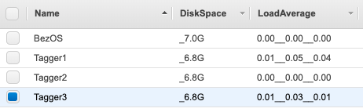

# Dynamic-Tags

Dynamic Tags uses the create-tags API, meta-data service and some system monitoring utilities.
AWS CLI needs to be installed and configured with the appropriate tagging permissions.

This is what it looks like:

